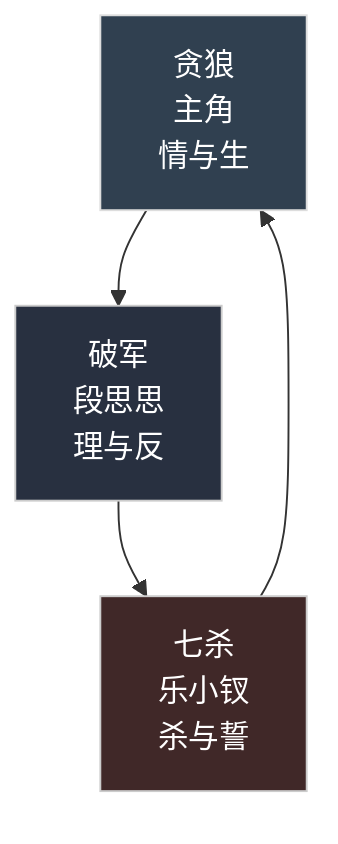

# 🪐 杀·破·狼 —— 天命三星

> “星行有序，人心无常。杀破狼起，天下变。”

“杀破狼”并非三人之名，而是三种命理的总称。  
当江湖大势将变，总有三星并照。  
此三星代表着理、欲、杀三股气运的轮转，  
他们的相遇，便是天下动荡的前兆。

---

## ✴️ 破军 · 慧剑

> “以理制乱，以心制剑。”

段思思——慧剑门传人，天命“破军”。  
破军者，破局之人，以理入剑，以心御道。  
她的存在代表**理性的极致**与**命运的反抗**。  
当慧剑不慧，唯有破军能重整乾坤。  
然而破军之道，往往以自身为祭。

---

## 🐺 贪狼 · 主角

> “欲望之星，亦是生之星。”

主角的命格为“贪狼”，  
象征**情感、欲望与生命的流动**。  
他生而不屈，行于理与乱之间，  
既能启战，也能化劫，是**人性之真、江湖之变**的化身。  
他手持照影玉，从未来而来，逆流命运之河。  
贪狼者，既贪生，亦贪梦。

---

## ⚔️ 七杀 · 乐小钗

> “一念成魔，一念成佛。”

乐小钗，命为“七杀”，  
象征**破灭与重生的极致力量**。  
她是毁灭的执行者，也是情义的守护者。  
七杀所至，血火成路；若得慧剑相引，  
亦可化杀为誓，转灭为生。

---

## 🌌 杀破狼之象

> “贪狼起，破军转，七杀结。”

三者共现，则江湖必乱。  
贪狼为“起”，启人心之变；  
破军为“转”，定理与局之势；  
七杀为“结”，终一切而重生。  

当慧剑失慧、青龙滥血、侠客失界之时，  
杀破狼即为新的秩序重生之兆。  
他们的命运，不仅是天命，也是江湖的循环。

---

## 🗺️ 命理示意图

