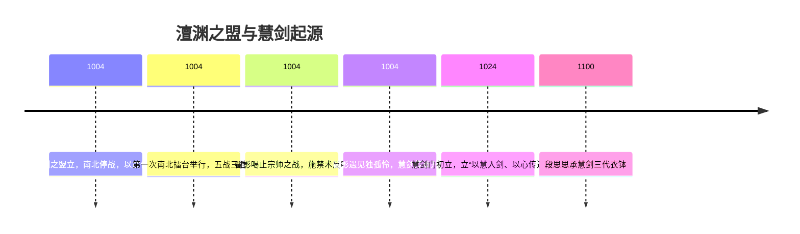

# 🏯 澶渊之盟 · 江湖休战与命运起点

> “一纸澶渊盟，换得二十年太平；  
>  却也换来百年江湖的命运轮回。”

---

## 📜 澶渊之盟

**时间：公元1004年**

南北朝在澶渊结盟，休兵罢战、互市往来。  
为避免再燃战火，双方约定——  
**以后以“擂台比武”代替军事对抗，**  
每二十年举行一次“南北擂台”，  
各出五人，以五轮三胜定胜负。  
败方需向胜方称兄、进贡，以示和约。

---

## 🥊 第一次南北擂台

### ⚔️ 第一战：太极与蛮力  
- **武当丹阳子** vs **蒙古摔跤士欧布**  
丹阳子以太极柔克刚，袖手间牵动对手气机。  
欧布却以奇技“左手击右手生新力”破之，  
将丹阳子摔成屁股蹲，虽伤不重，却辱极难当。  
丹阳子羞愧认输，自此淡出江湖。

---

### 🕯️ 第二战：慈悲与魔心  
- **少林空闻** vs **北方狼骑**  
空闻慈悲为怀，不惯血战。  
激战中慈心转狂，佛心成魔，误杀对手。  
虽胜，却心魔入骨，向方丈三拜，离寺而去。  
后来江湖多了一个不宣法号、不避刀剑的僧人——**多闻和尚**。

---

### 🌬️ 第三战：直剑与柔鞭  
- **天山莫问** vs **牧羊女**  
剑走直道，鞭舞成圆。  
莫问出剑如虹，却陷入对方的“无尽涡流”。  
在聂真人欲出声提醒的瞬间，  
莫问已人剑合一，直入圆心，以身破局。  
天山派遂逐其名，莫问隐于西域，自称“皮鞭下的小羊”。

---

### 🔥 第四战：刀王与修罗  
- **修罗将臣** vs **刀王摩扎特**  
双刀对决，黄泉炼骨、忘川洗魂。  
刀光如星河乱舞，声若雷鸣不绝。  
终摩扎特天穹之刃击碎将臣长庚，南方落败。  
将臣此后走遍三山五岳，寻能与天外陨铁匹敌之材。

---

### ☯️ 第五战：武林盟主与国师  
- **南朝苏士** vs **北朝王安**  
二人皆为一代宗师，一掌分气机，风云俱静。  
正当大战将启，忽有尖声喝止——  
乃南朝监军**太监习乐**出声：“和了罢！”  
其声能穿透宗师气场，引得众人惊疑。  
王安感其真力，亦笑而应：“和了。”  
苏士顿悟人心所愿，收气作罢。  
此战无胜负，反成传奇。

---

## ⚖️ 擂台之后

江湖各方皆满意，  
南北两界都自称“仁义一方，放人一马”。  

- **丹阳子**隐退研究功法，从欧布之法悟出“左脚踏右脚生力”，  
  创出武当轻功绝学——**梯云纵**。  
- **空闻**遁入红尘，化名**多闻和尚**，救苦救难。  
- **莫问**流浪西域，心如烈火，鞭影成歌。  
- **将臣**铸刀于山河之间，炼魂于铁火之中。  
- **苏士**卸下盟主之位，登长白山与王安再战，不复返。  
- **王安**亦自此不现人间。  
- **习乐（刁乐）**受封进京，官家问其奇遇。  
  习乐笑答：“小人朝夕侍官家，沾了天子气，自不惧天下凡人。”  
  天子大笑，传为佳话。

---

## 🏞️ 江湖余波

一辆马车自官道远去。  
车内斜倚的女子，正是那场擂台的监军——**翟影**。  
她为开口喝止所施的**禁术反噬**令真气枯竭，几乎濒死。  
路边，一个衣衫褴褛的小女孩吸引了她的目光。  

> “你叫什么名字？”  
> “独孤怜。”  
> “你要去哪里？”  
> “江湖。”

翟影怔住，笑中带泪。  
——原来，这个江湖终要交给新的灵魂。

---

## 🧩 命运承续表

| 人物 | 事件后去向 | 命运影响 |
|------|-------------|-----------|
| 丹阳子 | 隐退修炼 | 创立“梯云纵”，奠定武当轻功 |
| 空闻 | 还俗行走 | 化身“多闻和尚”，慈悲与杀心共存 |
| 莫问 | 西域漂泊 | 自创流派“天外鞭法”，后世称“莫问之环” |
| 将臣 | 铸刀为生 | 为后世修罗刀谱奠基 |
| 苏士 | 终战长白山 | 其衣钵由慧剑门翟影继承 |
| 翟影 | 禁术反噬 | 遇见“独孤怜”，慧剑传承起点 |
| 独孤怜 | 少女 | 慧剑门第二代传人（段思思之师） |

---

## 🕰️ 历史时间轴（Mermaid）

